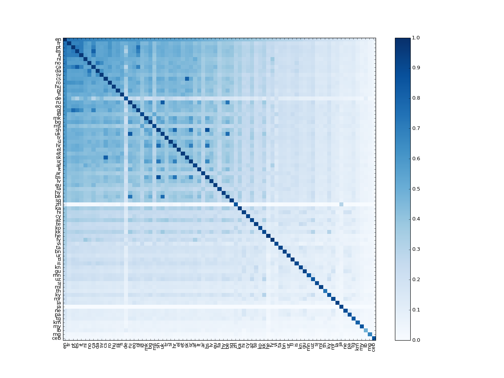

# Aligning the fastText vectors of 78 languages

Facebook recently open-sourced word vectors in [89 languages](https://github.com/facebookresearch/fastText/blob/master/pretrained-vectors.md). However these vectors are monolingual; meaning that while similar words within a language share similar vectors, translation words from different languages do not have similar vectors. In [a recent paper at ICLR 2017](https://arxiv.org/abs/1702.03859), we showed how the SVD can be used to learn a linear transformation (a matrix), which aligns monolingual vectors from two languages in a single vector space. In this repository we provide 78 matrices, which can be used to align the majority of the fastText languages in a single space.

This readme explains how the matrices should be used. We also present a simple evaluation task, where we show we are able to successfully predict the translations of words in multiple languages. Our procedure relies on collecting bilingual training dictionaries of word pairs in two languages, but remarkably we are able to successfully predict the translations of words between language pairs for which we had no training dictionary!

Word embeddings define the similarity between two words by the normalised inner product of their vectors. The matrices in this repository place languages in a single space, **without changing any of these monolingual similarity relationships**. When you use the resulting multilingual vectors for monolingual tasks, they will perform exactly the same as the original vectors. To learn more about word embeddings, check out [Colah's blog](http://colah.github.io/posts/2014-07-NLP-RNNs-Representations/) or [Sam's introduction to vector representations](https://www.samtalksml.net/from-linear-regression-to-vector-representations/). 

Note that since we released this repository Facebook have released an additional 204 languages; however the word vectors of the original 90 languages have not changed, and the transformations provided in this repository will still work. If you would like to learn your own alignment matrices, we provide an example in [align_your_own.ipynb](./align_your_own.ipynb).

If you use this repository, please cite:

*Offline bilingual word vectors, orthogonal transformations and the inverted softmax  
Samuel L. Smith, David H. P. Turban, Steven Hamblin and Nils Y. Hammerla  
ICLR 2017 (conference track)*

### TLDR, just tell me what to do!
Clone a local copy of this repository, and download the fastText vectors you need from [here](https://github.com/facebookresearch/fastText/blob/master/pretrained-vectors.md). I'm going to assume you've downloaded the vectors for French and Russian in the text format. Let's say we want to compare the similarity of "chat" and "кот". We load the word vectors:
```python
from fasttext import FastVector
fr_dictionary = FastVector(vector_file='wiki.fr.vec')
ru_dictionary = FastVector(vector_file='wiki.ru.vec')
```
We can extract the word vectors and calculate their cosine similarity:
```python
fr_vector = fr_dictionary["chat"]
ru_vector = ru_dictionary["кот"]
print(FastVector.cosine_similarity(fr_vector, ru_vector))
# Result should be 0.02
```
The cosine similarity runs between -1 and 1. It seems that "chat" and "кот" are neither similar nor dissimilar. But now we apply the transformations to align the two dictionaries in a single space:
```python
fr_dictionary.apply_transform('alignment_matrices/fr.txt')
ru_dictionary.apply_transform('alignment_matrices/ru.txt')
```
And re-evaluate the cosine similarity:
```python
print(FastVector.cosine_similarity(fr_dictionary["chat"], ru_dictionary["кот"]))
# Result should be 0.43
```
Turns out "chat" and "кот" are pretty similar after all. This is good, since they both mean "cat".

### Ok, so how did you obtain these matrices?
Of the 89 languages provided by Facebook, 78 are supported by the [Google Translate API](https://cloud.google.com/translate/docs/). We first obtained the 10,000 most common words in the English fastText vocabulary, and then use the API to translate these words into the 78 languages available. We split this vocabulary in two, assigning the first 5000 words to the training dictionary, and the second 5000 to the test dictionary.

We described the alignment procedure [in this blog](https://www.samtalksml.net/aligning-vector-representations/). It takes two sets of word vectors and a small bilingual dictionary of translation pairs in two languages; and generates a matrix which aligns the source language with the target. Sometimes Google translates an English word to a non-English phrase, in these cases we average the word vectors contained in the phrase.

To place all 78 languages in a single space, **we align every language to the English vectors** (the English matrix is the identity).

### Right, now prove that this procedure actually worked...

To prove that the procedure works, we can predict the translations of words not seen in the training dictionary. For simplicity we predict translations by nearest neighbours. So for example, if we wanted to translate "dog" into Swedish, we would simply find the Swedish word vector whose cosine similarity to the "dog" word vector is highest.

First things first, let's test the translation performance from English into every other language. For each language pair, we extract a set of 2500 word pairs from the test dictionary. The precision @n denotes the probability that, of the 2500 target words in this set, the true translation was one of the top n nearest neighbours of the source word. If the alignment was completely random, we would expect the precision @1 to be around 0.0004.

| Target language | Precision @1 | Precision @5 | Precision @10 |
|-----------------|--------------|--------------|---------------|
| fr              | 0.73         | 0.86         | 0.88          |
| pt              | 0.73         | 0.86         | 0.89          |
| es              | 0.72         | 0.85         | 0.88          |
| it              | 0.70         | 0.86         | 0.89          |
| nl              | 0.68         | 0.83         | 0.86          |
| no              | 0.68         | 0.85         | 0.89          |
| da              | 0.66         | 0.84         | 0.88          |
| ca              | 0.66         | 0.81         | 0.86          |
| sv              | 0.65         | 0.82         | 0.86          |
| cs              | 0.64         | 0.81         | 0.85          |
| ro              | 0.63         | 0.81         | 0.85          |
| de              | 0.62         | 0.75         | 0.78          |
| pl              | 0.62         | 0.79         | 0.83          |
| hu              | 0.61         | 0.80         | 0.84          |
| fi              | 0.61         | 0.80         | 0.84          |
| eo              | 0.61         | 0.80         | 0.85          |
| ru              | 0.60         | 0.78         | 0.82          |
| gl              | 0.60         | 0.77         | 0.82          |
| mk              | 0.58         | 0.79         | 0.84          |
| id              | 0.58         | 0.81         | 0.86          |
| bg              | 0.57         | 0.77         | 0.82          |
| ms              | 0.57         | 0.81         | 0.86          |
| uk              | 0.57         | 0.75         | 0.79          |
| sh              | 0.56         | 0.77         | 0.81          |
| hr              | 0.56         | 0.75         | 0.80          |
| tr              | 0.56         | 0.77         | 0.81          |
| sl              | 0.56         | 0.77         | 0.82          |
| el              | 0.54         | 0.75         | 0.80          |
| sk              | 0.54         | 0.75         | 0.81          |
| et              | 0.53         | 0.73         | 0.78          |
| sr              | 0.53         | 0.72         | 0.77          |
| af              | 0.52         | 0.75         | 0.80          |
| lt              | 0.50         | 0.72         | 0.79          |
| ar              | 0.48         | 0.69         | 0.75          |
| bs              | 0.47         | 0.70         | 0.77          |
| lv              | 0.47         | 0.68         | 0.75          |
| eu              | 0.46         | 0.68         | 0.75          |
| fa              | 0.45         | 0.68         | 0.75          |
| hy              | 0.43         | 0.66         | 0.73          |
| sq              | 0.43         | 0.65         | 0.71          |
| be              | 0.43         | 0.64         | 0.70          |
| zh              | 0.40         | 0.68         | 0.75          |
| ka              | 0.40         | 0.63         | 0.71          |
| cy              | 0.39         | 0.63         | 0.71          |
| hi              | 0.39         | 0.58         | 0.63          |
| az              | 0.38         | 0.60         | 0.67          |
| ko              | 0.37         | 0.58         | 0.66          |
| te              | 0.36         | 0.56         | 0.63          |
| kk              | 0.35         | 0.60         | 0.68          |
| he              | 0.33         | 0.45         | 0.48          |
| fy              | 0.33         | 0.52         | 0.60          |
| vi              | 0.31         | 0.53         | 0.62          |
| ta              | 0.31         | 0.50         | 0.56          |
| bn              | 0.30         | 0.49         | 0.56          |
| ur              | 0.29         | 0.52         | 0.61          |
| is              | 0.29         | 0.51         | 0.59          |
| tl              | 0.28         | 0.51         | 0.59          |
| kn              | 0.28         | 0.43         | 0.46          |
| gu              | 0.25         | 0.44         | 0.51          |
| mn              | 0.25         | 0.49         | 0.58          |
| uz              | 0.24         | 0.43         | 0.51          |
| si              | 0.22         | 0.40         | 0.45          |
| ml              | 0.21         | 0.35         | 0.39          |
| ky              | 0.20         | 0.40         | 0.49          |
| mr              | 0.20         | 0.37         | 0.44          |
| th              | 0.20         | 0.33         | 0.38          |
| la              | 0.19         | 0.34         | 0.42          |
| ja              | 0.18         | 0.44         | 0.56          |
| ne              | 0.16         | 0.33         | 0.38          |
| pa              | 0.16         | 0.32         | 0.38          |
| tg              | 0.14         | 0.31         | 0.39          |
| km              | 0.12         | 0.26         | 0.30          |
| my              | 0.10         | 0.19         | 0.23          |
| lb              | 0.09         | 0.18         | 0.21          |
| mg              | 0.07         | 0.18         | 0.25          |
| ceb             | 0.06         | 0.13         | 0.18          |

As you can see, the alignment is consistently much better than random! In general, the procedure works best for other European languages like French, Portuguese and Spanish. We use 2500 word pairs, because of the 5000 words in the test dictionary, not all the words found by the Google Translate API are actually present in the fastText vocabulary.

Now let's do something much more exciting, let's evaluate the translation performance between all possible language pairs. We exhibit this translation performance on the heatmap below, where the colour of an element denotes the precision @1 when translating from the language of the row into the language of the column.



We should emphasize that **all of the languages were aligned to English only**. We did not provide training dictionaries between non-English language pairs. Yet we are still able to succesfully predict translations between pairs of non-English languages remarkably accurately. 

We expect the diagonal elements of the matrix above to be 1, since a language should translate perfectly to itself. However in practice this does not always occur, because we constructed the training and test dictionaries by translating common English words into the other languages. Sometimes multiple English words translate to the same non-English word, and so the same non-English word may appear multiple times in the test set. We haven't properly accounted for this, which reduces the translation performance.

Intriquingly, even though we only directly aligned the languages to English, sometimes a language translates better to another non-English language than it does to English! We can calculate the inter-pair precision of two languages; the average precision from language 1 to language 2 and vice versa. We can also calculate the English-pair precision; the average of the precision from English to language 1 and from English to language 2. Below we list all the language pairs for which the inter-pair precision exceeds the English-pair precision:

| Language 1 | Language 2 | Inter-pair precision @1 | English-pair precision @1  |
|:----------:|:----------:|:-----------------------:|:-------------------------:|
|     bs     |     sh     |           0.88          |            0.52           |
|     ru     |     uk     |           0.84          |            0.58           |
|     ca     |     es     |           0.82          |            0.69           |
|     cs     |     sk     |           0.82          |            0.59           |
|     hr     |     sh     |           0.78          |            0.56           |
|     be     |     uk     |           0.77          |            0.50           |
|     gl     |     pt     |           0.76          |            0.66           |
|     bs     |     hr     |           0.74          |            0.52           |
|     be     |     ru     |           0.73          |            0.51           |
|     da     |     no     |           0.73          |            0.67           |
|     sr     |     sh     |           0.73          |            0.54           |
|     pt     |     es     |           0.72          |            0.72           |
|     ca     |     pt     |           0.70          |            0.69           |
|     gl     |     es     |           0.70          |            0.66           |
|     hr     |     sr     |           0.69          |            0.54           |
|     ca     |     gl     |           0.68          |            0.63           |
|     bs     |     sr     |           0.67          |            0.50           |
|     mk     |     sr     |           0.56          |            0.55           |
|     kk     |     ky     |           0.30          |            0.28           |

All of these language pairs share very close linguistic roots. For instance the first pair above are Bosnian and Serbo-Croatian; Bosnian is a variant of Serbo-Croatian. The second pair is Russian and Ukranian; both east-slavic languages. It seems that the more similar two languages are, the more similar the geometry of their fastText vectors; leading to improved translation performance.


### How do I know these matrices don't change the monolingual vectors?

The matrices provided in this repository are orthogonal. Intuitively, each matrix can be broken down into a series of rotations and reflections. Rotations and reflections do not change the distance between any two points in a vector space; and consequently none of the inner products between word vectors within a language are changed, only the inner products between the word vectors of different languages are affected.


### References

There are a number of great papers on this topic. We've listed a few of them below:

1. [Enriching word vectors with subword information](https://arxiv.org/abs/1607.04606)  
Bojanowski et al., 2016
2. [Offline bilingual word vectors, orthogonal transformations and the inverted softmax](https://arxiv.org/abs/1702.03859)  
Smith et al., ICLR 2017
3. [Exploiting similarities between languages for machine translation](https://arxiv.org/abs/1309.4168)  
Mikolov et al., 2013
4. [Improving vector space word representations using multilingual correlation](http://repository.cmu.edu/cgi/viewcontent.cgi?article=1031&context=lti)  
Faruqui and Dyer, EACL 2014
5. [Improving zero-shot learning by mitigating the hubness problem](https://arxiv.org/abs/1412.6568)  
Dinu et al., 2014
6. [Learning principled bilingual mappings of word embeddings while preserving monolingual invariance](https://pdfs.semanticscholar.org/9a2e/ed5f8175275af0d55d4aed39afc8e2b2acf2.pdf?_ga=1.8571637.130713154.1492676520)  
Artetxe et al., EMNLP 2016

### Training and test dictionaries

A number of readers have expressed an interest in the training and test dictionaries we used in this repository. We would have liked to upload these, however, while we have not taken legal advice, we are concerned that this could be interpreted as breaking the terms of the Google Translate API.

## License

The transformation matrices are distributed under the [*Creative Commons Attribution-Share-Alike License 3.0*](https://creativecommons.org/licenses/by-sa/3.0/).
